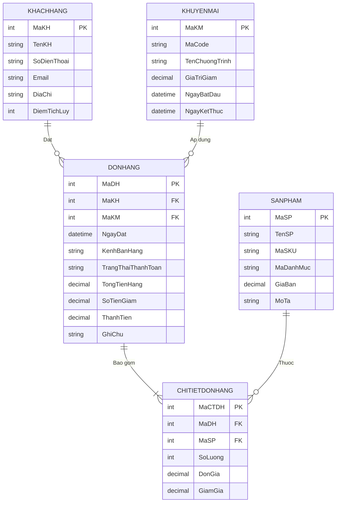

```mermaid
erDiagram
    KHACHHANG ||--o{ DONHANG : "Dat"
    KHUYENMAI ||--o{ DONHANG : "Ap dung"
    DONHANG ||--|{ CHITIETDONHANG : "Bao gom"
    SANPHAM ||--o{ CHITIETDONHANG : "Thuoc"

    KHACHHANG {
        int MaKH PK
        string TenKH
        string SoDienThoai
        string Email
        string DiaChi
        int DiemTichLuy
    }
    SANPHAM {
        int MaSP PK
        string TenSP
        string MaSKU
        string MaDanhMuc
        decimal GiaBan
        string MoTa
    }
    KHUYENMAI {
        int MaKM PK
        string MaCode
        string TenChuongTrinh
        decimal GiaTriGiam
        datetime NgayBatDau
        datetime NgayKetThuc
    }
    DONHANG {
        int MaDH PK
        int MaKH FK
        int MaKM FK
        datetime NgayDat
        string KenhBanHang
        string TrangThaiThanhToan
        decimal TongTienHang
        decimal SoTienGiam
        decimal ThanhTien
        string GhiChu
    }
    CHITIETDONHANG {
        int MaCTDH PK
        int MaDH FK
        int MaSP FK
        int SoLuong
        decimal DonGia
        decimal GiamGia
    }
```
