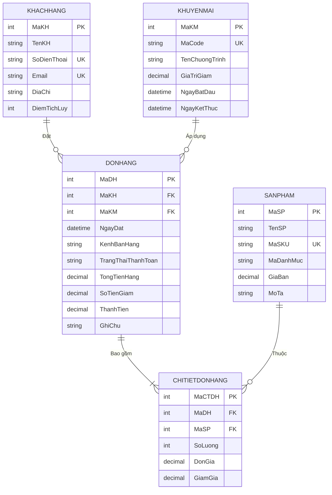

# 📚 Quản Lý Bán Hàng — Cửa Hàng Sách

> **Bài tập lớn môn Cơ sở dữ liệu**
> Hệ thống quản lý bán hàng cho cửa hàng sách, xây dựng trên SQL Server (T-SQL).

---

## 📋 Mô tả dự án

Dự án xây dựng cơ sở dữ liệu **QL_BANHANG** để quản lý toàn bộ hoạt động kinh doanh của một cửa hàng sách, bao gồm:

- Quản lý **khách hàng** và điểm tích lũy
- Quản lý **sản phẩm** (sách) theo danh mục
- Quản lý **chương trình khuyến mãi** (voucher, mã giảm giá)
- Quản lý **đơn hàng** đa kênh (Tại quầy, Website, Shopee, Lazada, TikTok Shop)
- Quản lý **chi tiết đơn hàng** cho từng sản phẩm
- **Trigger tự động** tính tổng tiền hàng và thành tiền
- **Báo cáo kinh doanh** phân tích doanh thu, sản phẩm, khách hàng

---

## 🗂️ Cấu trúc dự án

| File | Mô tả |
|------|--------|
| `01_init_structure.sql` | Tạo database và 5 bảng (chuẩn 3NF) với các constraint |
| `02_insert_data 1.sql` | Chèn dữ liệu mẫu: 15 khách hàng, 30 sản phẩm, 7 khuyến mãi, 25 đơn hàng, ~75 chi tiết |
| `03_optimization_logic.sql` | Tạo 9 index tối ưu + 2 trigger tự động tính tiền |
| `04_business_reports.sql` | 8 báo cáo kinh doanh (doanh thu, sản phẩm, khách hàng, kênh bán...) |
| `Data.md` | Tài liệu mô tả cấu trúc dữ liệu các bảng |
| `ER_Diagram_Mermaid.md` | Sơ đồ quan hệ thực thể (Entity-Relationship Diagram) |

---

## 🚀 Hướng dẫn cài đặt & chạy

### Yêu cầu

- **SQL Server** 2016 trở lên (hoặc SQL Server Express)
- **SQL Server Management Studio (SSMS)** hoặc Azure Data Studio

### Các bước thực hiện

```
Bước 1:  Mở SSMS, kết nối SQL Server
Bước 2:  Chạy 01_init_structure.sql      → Tạo database + bảng
Bước 3:  Chạy 02_insert_data 1.sql       → Chèn dữ liệu mẫu
Bước 4:  Chạy 03_optimization_logic.sql  → Tạo index + trigger
Bước 5:  Chạy 04_business_reports.sql    → Xem báo cáo kinh doanh
```

> ⚠️ **Lưu ý:** Phải chạy theo đúng thứ tự từ file 01 đến 04. Mỗi file phụ thuộc vào kết quả của file trước đó.

---

## 📊 Sơ đồ quan hệ (ER Diagram)



---

## 🏗️ Kiến trúc Database

### 5 bảng chính (chuẩn 3NF)

| Bảng | Mô tả | Số bản ghi mẫu |
|------|--------|:-:|
| **KHACHHANG** | Thông tin khách hàng, điểm tích lũy | 15 |
| **SANPHAM** | Danh mục sách (Văn học, Kinh tế, Kỹ năng, Thiếu nhi, Khoa học) | 30 |
| **KHUYENMAI** | Mã giảm giá, chương trình ưu đãi | 7 |
| **DONHANG** | Đơn hàng tổng hợp, đa kênh bán | 25 |
| **CHITIETDONHANG** | Chi tiết từng sản phẩm trong đơn | ~75 |

### Tính năng nổi bật

- ✅ **Constraint đầy đủ**: PRIMARY KEY, FOREIGN KEY, UNIQUE, CHECK, DEFAULT
- ✅ **9 Index tối ưu** truy vấn: theo khách hàng, ngày đặt, trạng thái, kênh bán, danh mục...
- ✅ **2 Trigger tự động**:
  - `TRG_CTDH_CAP_NHAT`: Khi thay đổi chi tiết → cập nhật `TongTienHang` của đơn
  - `TRG_DH_TINH_THANHTIEN`: Khi `TongTienHang` hoặc `SoTienGiam` đổi → tính `ThanhTien`
- ✅ **5 kênh bán hàng**: Tại quầy, Website, Shopee, Lazada, TikTok Shop
- ✅ **4 trạng thái đơn**: Chưa thanh toán, Đã thanh toán, Hoàn tiền, Hủy

---

## 📈 Danh sách báo cáo (File 04)

| # | Báo cáo | Nội dung |
|:-:|---------|----------|
| 1 | **Tổng quan doanh thu** | Tổng đơn, doanh thu, trung bình/đơn, theo ngày, theo tháng |
| 2 | **Sản phẩm bán chạy** | Top 10 theo số lượng, top 10 theo doanh thu, sản phẩm chưa bán |
| 3 | **Doanh thu theo danh mục** | So sánh nhóm sách, tỉ trọng đóng góp (%) |
| 4 | **Phân tích khách hàng** | Top chi tiêu, phân loại VIP/Thân thiết/Tiềm năng/Mới |
| 5 | **Kênh bán hàng** | So sánh kênh, Online vs Offline |
| 6 | **Hiệu quả khuyến mãi** | Số đơn áp dụng, tổng giảm giá, tỉ lệ sử dụng KM |
| 7 | **Trạng thái đơn hàng** | Thống kê trạng thái, danh sách đơn chưa thanh toán |
| 8 | **Dashboard tổng hợp** | Các chỉ số chính cho giao diện quản lý |

---

## 📝 Ghi chú

- Collation: `Vietnamese_CI_AS` — hỗ trợ tiếng Việt có dấu
- Dữ liệu mẫu mô phỏng cửa hàng sách với 5 danh mục: Văn học, Kinh tế, Kỹ năng, Thiếu nhi, Khoa học
- Trigger sử dụng chiến lược 2 lớp (CHITIETDONHANG → DONHANG) để đảm bảo tính nhất quán dữ liệu

---

## 📄 License

Dự án được phân phối theo giấy phép MIT — xem file [LICENSE](LICENSE) để biết thêm chi tiết.
