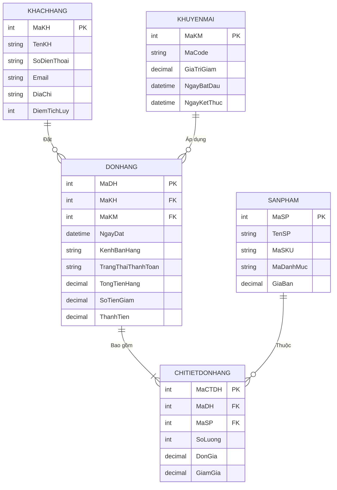

# 🛒 Hệ Thống Quản Lý Bán Hàng — SQL Server

> **Bài tập lớn môn Cơ sở Dữ liệu** · T-SQL · SQL Server

Hệ thống cơ sở dữ liệu quản lý bán hàng đa kênh (Tại quầy, Website, Shopee, Lazada, TikTok Shop) được thiết kế theo **chuẩn 3NF**, hỗ trợ quản lý khách hàng, sản phẩm, khuyến mãi, đơn hàng và chi tiết đơn hàng với cơ chế **trigger tự động tính toán tài chính**.

---

## 📐 Sơ Đồ Quan Hệ (ER Diagram)



---

## 🗂️ Cấu Trúc Dự Án

| File | Mô tả |
|------|--------|
| `01_init_structure.sql` | Tạo database `QL_BANHANG` và 5 bảng với đầy đủ ràng buộc (PK, FK, UNIQUE, CHECK) |
| `02_insert_data 1.sql` | Chèn dữ liệu mẫu cho toàn bộ 5 bảng để kiểm thử |
| `03_optimization_logic.sql` | Tạo 9 chỉ mục tối ưu truy vấn + 2 trigger tự động tính tiền |
| `Data.md` | Tài liệu giải thích ý nghĩa từng trường dữ liệu |
| `ER_Diagram_Mermaid.md` | Sơ đồ ER dạng Mermaid (hiển thị trực tiếp trên GitHub) |

---

## 🏗️ Mô Tả 5 Bảng

### 1. KHACHHANG
Quản lý thông tin khách hàng: họ tên, SĐT, email, địa chỉ và điểm tích lũy cho chương trình khách hàng thân thiết.
- `SoDienThoai`, `Email`: ràng buộc **UNIQUE** — không trùng lặp
- `DiemTichLuy`: ràng buộc **CHECK ≥ 0**

### 2. SANPHAM
Danh mục hàng hóa đang kinh doanh, phân loại theo nhóm (Áo Nam, Quần Nữ, Phụ Kiện...).
- `MaSKU`: mã kho nội bộ **UNIQUE**
- `GiaBan`: ràng buộc **CHECK ≥ 0**

### 3. KHUYENMAI
Quản lý voucher/chiến dịch khuyến mãi với mã code, giá trị giảm và thời hạn hiệu lực.
- `MaCode`: mã voucher **UNIQUE**
- `GiaTriGiam > 0`, `NgayKetThuc > NgayBatDau`: đảm bảo dữ liệu hợp lệ

### 4. DONHANG
Ghi nhận mỗi lần giao dịch — khách nào mua, qua kênh nào, áp mã giảm giá gì.
- Hỗ trợ **5 kênh bán hàng**: `TAI_QUAY`, `WEBSITE`, `SHOPEE`, `LAZADA`, `TIKTOK_SHOP`
- Hỗ trợ **4 trạng thái**: `CHUA_THANH_TOAN`, `DA_THANH_TOAN`, `HOAN_TIEN`, `HUY`
- `ThanhTien` được **trigger tự động tính** = `TongTienHang - SoTienGiam`

### 5. CHITIETDONHANG
Chi tiết từng sản phẩm trong đơn hàng (số lượng, đơn giá snapshot, giảm giá riêng).
- Ràng buộc **UNIQUE (MaDH, MaSP)**: mỗi sản phẩm chỉ xuất hiện 1 lần/đơn
- `DonGia` là giá **snapshot** tại thời điểm mua — không đổi khi giá sản phẩm thay đổi sau

---

## ⚡ Tính Năng Nổi Bật

### 🔗 Ràng Buộc Toàn Vẹn
- **ON DELETE NO ACTION** trên FK `DONHANG → KHACHHANG`: bảo vệ lịch sử giao dịch
- **ON DELETE SET NULL** trên FK `DONHANG → KHUYENMAI`: xóa chương trình KM không ảnh hưởng đơn
- **ON DELETE CASCADE** trên FK `CHITIETDONHANG → DONHANG`: xóa đơn → dọn sạch chi tiết

### ⚙️ Trigger Tự Động (2 lớp)
| Trigger | Bảng | Chức năng |
|---------|------|-----------|
| `TRG_CTDH_CAP_NHAT` | CHITIETDONHANG | Khi thêm/sửa/xóa chi tiết → tự cập nhật `TongTienHang` của đơn cha |
| `TRG_DH_TINH_THANHTIEN` | DONHANG | Khi `TongTienHang` hoặc `SoTienGiam` thay đổi → tự tính `ThanhTien` |

### 📊 Chỉ Mục Tối Ưu (9 index)
Tối ưu cho các truy vấn phổ biến: tìm đơn theo khách, báo cáo doanh thu theo ngày, lọc theo trạng thái thanh toán, phân tích kênh bán hàng, xếp hạng khách VIP...

---

## 🚀 Hướng Dẫn Sử Dụng

### Yêu cầu
- **SQL Server** 2016 trở lên (hỗ trợ `CREATE OR ALTER`)
- **SQL Server Management Studio (SSMS)** hoặc công cụ tương đương

### Chạy script theo thứ tự

```
Bước 1 → 01_init_structure.sql       (tạo database + 5 bảng)
Bước 2 → 02_insert_data 1.sql        (chèn dữ liệu mẫu)
Bước 3 → 03_optimization_logic.sql   (tạo index + trigger + demo)
```

> ⚠️ **Lưu ý:** Phải chạy đúng thứ tự. Script 01 sẽ **xóa và tạo lại** database `QL_BANHANG` nếu đã tồn tại.

---

## 📈 Dữ Liệu Mẫu

| Bảng | Số bản ghi |
|------|-----------|
| KHACHHANG | 6 |
| SANPHAM | 8 |
| KHUYENMAI | 5 |
| DONHANG | 7 |
| CHITIETDONHANG | 10 |

---

## 🛠️ Công Nghệ

- **Hệ quản trị:** Microsoft SQL Server
- **Ngôn ngữ:** T-SQL (Transact-SQL)
- **Collation:** `Vietnamese_CI_AS`
- **Chuẩn thiết kế:** 3NF (Third Normal Form)
